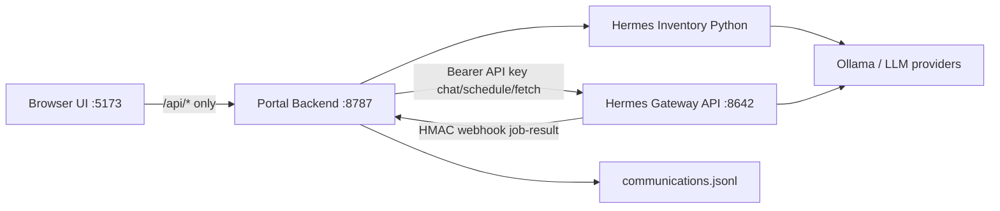

# ecept Hermes Web Client

Web portal for working with the **Hermes Agent** application. The portal has an independent frontend and backend; the browser only talks to the portal backend, which proxies Hermes.

| App | Path | Default URL | Stack |
|-----|------|-------------|-------|
| Frontend | `frontend/` | http://localhost:5173 | React 19, Vite, TypeScript, Tailwind CSS |
| Backend API | `backend/` | http://localhost:8787 | Express, TypeScript, Node.js |

---

## Status — Phase 1 completed

Phase 1 of **ecept Hermes Web Client** is implemented, configured against a local Hermes gateway, and verified end-to-end (including cron webhook callbacks).

### Completed deliverables

| Area | Status | Details |
|------|--------|---------|
| Greenfield project under `hermes-client-webportal` | Done | Frontend + backend run independently |
| Communicate page (Layout B — split composer / result) | Done | Instruction box, expandable action bar, result panel |
| Chat action | Done | Proxies to Hermes `POST /v1/chat/completions` |
| Schedule Task action | Done | Proxies to Hermes `POST /api/jobs` with `deliver=webhook` when configured |
| Token + latency metrics | Done | Input/output tokens and response time shown in UI |
| Local communication log | Done | JSONL at `backend/logs/communications.jsonl` |
| History page | Done | Lists communications; schedule rows show execution results |
| Fetch result from Hermes | Done | Manual pull via `GET /api/jobs/{id}/output` when webhook was missed |
| Cron webhook callback | Done | Hermes `POST`s signed results to `/api/webhooks/hermes/job-result` |
| LLM model selection | Done | Full provider inventory (same source as Hermes model picker) |
| Hermes API URL configuration | Done | Settings page; persisted in `backend/data/settings.json` |
| Hermes API server enablement | Done | `API_SERVER_*` set in Hermes `.env`; gateway restarted |
| Portal ↔ Hermes connection test | Done | Health, auth, models, chat verified |
| Webhook callback verification | Done | Confirmed failed deliveries vs successful `source=webhook` after gateway restart |

### Verified behavior

- Hermes `GET /health` and authenticated chat completions
- Portal model list returns Hermes inventory models (Ollama + other configured providers)
- Portal chat returns expected replies with tokens and timing recorded
- Communications are written to the local log and appear on History
- Scheduled jobs can return results via:
  - **webhook** — Hermes pushes to the portal automatically (`executionResult.source = "webhook"`)
  - **fetch** — user clicks **Fetch result from Hermes** (`executionResult.source = "fetch"`)

### Cron callback note (verified 2026-07-14)

For job `653651d66adb` (`portal-task-2026-07-14-02-05-02`):

1. Hermes **did execute** the job (output available in Hermes and via Fetch).
2. Early runs logged Hermes warning: `no delivery target resolved for deliver=webhook` — **callback did not reach the portal**.
3. After **restarting the Hermes gateway** (so `CRON_WEBHOOK_SECRET` is loaded) and re-running, Hermes logged  
   `Cron webhook delivered ... to http://127.0.0.1:8787/api/webhooks/hermes/job-result` and the portal stored `source=webhook`.

**Always restart Hermes gateway after changing `CRON_WEBHOOK_SECRET` or webhook-related env.** In History, use **webhook** vs **fetch** on the execution result to see how the output arrived.

---

## Architecture



**Important design notes**

- The UI never calls Hermes directly.
- Hermes OpenAI `GET /v1/models` only advertises `hermes-agent` (agent identity). The portal’s model dropdown uses Hermes **provider inventory** (same substrate as `hermes model` / dashboard picker).
- Choosing a model in Chat updates Hermes’s main provider/model, then chats via the agent API (`model: hermes-agent` on the wire).
- Schedule Task prefers `deliver: webhook` + `callback.url` so Hermes can push results back without sharing a filesystem.

---

## UI pages

### Communicate (`/`)

Split layout:

- **Left:** work instruction textarea; LLM model dropdown (grouped by provider); schedule field; **Chat** / **Schedule Task** (action bar ready for future buttons)
- **Right:** Hermes response plus tokens, latency, and selected model

### History (`/history`)

- Sidebar list of past communications (action, status, preview, timestamp)
- Detail pane: instruction, model, schedule (if any), response, tokens, timing
- **Schedule items:**
  - Show Hermes **execution results** (latest + recent runs)
  - Each run is tagged **`webhook`** (callback) or **`fetch`** (manual pull)
  - **Fetch result from Hermes** button pulls the latest cron output on demand if a webhook was missed

### Settings (`/settings`)

- Hermes Agent API base URL
- Optional Hermes API key update (leave blank to keep existing)
- Reachability status after save

---

## Changes made on Hermes Agent (for this portal)

These edits were applied to the local Hermes Agent install (typically `%LOCALAPPDATA%\hermes`) so the portal can talk to the gateway API and receive cron callbacks. **No Hermes Agent source code was patched** for Phase 1 — only config / env / gateway restarts.

### 1. Gateway API server (required for portal proxy)

Added to Hermes home `.env` (not `config.yaml` — Hermes reads `API_SERVER_*` as environment variables):

```env
API_SERVER_ENABLED=true
API_SERVER_KEY=<shared-with-portal-HERMES_API_KEY>
API_SERVER_HOST=127.0.0.1
API_SERVER_PORT=8642
```

Notes:

- Early attempts that used `hermes config set API_SERVER_*` wrote keys into `config.yaml`; those were **removed** and moved into `.env` (correct place for the API server).
- Gateway was restarted after these changes (`hermes gateway restart`) so `:8642` serves `/health`, `/v1/chat/completions`, `/api/jobs`, etc.

### 2. Cron webhook secret (required for Schedule Task callbacks)

Added to Hermes home `.env`:

```env
CRON_WEBHOOK_SECRET=<shared-with-portal-HERMES_WEBHOOK_SECRET>
```

Must match the portal’s `HERMES_WEBHOOK_SECRET`. After adding/changing it, **restart the Hermes gateway** or Hermes may log `no delivery target resolved for deliver=webhook` instead of posting to the portal.

### 3. `config.yaml` adjustments (optional / operational)

| Setting | Value set for portal work | Why |
|---------|---------------------------|-----|
| `agent.environment_probe` | `false` | Faster/simpler agent turns during portal chat testing |
| `agent.max_turns` | `5` | Cap tool loops for quicker chat/cron verification |
| `custom_providers` → `ollama-local.model` | `llama3.1:8b` | Align Ollama custom provider with a known-good local model |

The live **main** model (`model.default` / `model.provider`) can change when the portal Chat page selects a model (that updates Hermes main model the same way the Hermes picker does). At verification time it may show values such as `openai-codex` / `gpt-5.4-mini` or `custom:ollama-local` / `llama3.1:8b` depending on last selection.

### 4. Gateway restarts performed

Hermes gateway was restarted multiple times during portal bring-up so that:

- API server listens on `127.0.0.1:8642`
- `CRON_WEBHOOK_SECRET` is loaded into the running process
- Cron webhook delivery to `http://127.0.0.1:8787/api/webhooks/hermes/job-result` succeeds

### Hermes-side checklist (recreate on another machine)

1. Enable API server + key in Hermes `.env` → restart gateway  
2. Set `CRON_WEBHOOK_SECRET` to the portal webhook secret → restart gateway  
3. Confirm `GET http://127.0.0.1:8642/health` returns OK  
4. Confirm portal backend is up and reachable at `PORTAL_PUBLIC_BASE_URL`

---

## Prerequisites

1. **Node.js 20+**
2. **Hermes Agent** with gateway API server (see [Changes made on Hermes Agent](#changes-made-on-hermes-agent-for-this-portal) above):
   - In Hermes home `.env` (e.g. `%LOCALAPPDATA%\hermes\.env`):
     - `API_SERVER_ENABLED=true`
     - `API_SERVER_KEY=<secret>`
     - `API_SERVER_HOST=127.0.0.1`
     - `API_SERVER_PORT=8642`
     - `CRON_WEBHOOK_SECRET=<same as portal HERMES_WEBHOOK_SECRET>`
   - Gateway running: `hermes gateway` (or the installed Windows scheduled task)
   - **Restart gateway** after changing API or webhook secrets
3. LLM provider healthy (e.g. Ollama / configured cloud provider) for successful chat and cron runs
4. Portal backend reachable from Hermes at `PORTAL_PUBLIC_BASE_URL` (for webhooks)

---

## Setup and run

```bash
# Backend
cd backend
copy .env.example .env
# Set HERMES_API_KEY to match Hermes API_SERVER_KEY
# Set HERMES_HOME, PORTAL_PUBLIC_BASE_URL, HERMES_WEBHOOK_SECRET
npm install
npm run dev

# Frontend (separate terminal)
cd frontend
npm install
npm run dev
```

Open http://localhost:5173

From repo root you can also use:

```bash
npm run install:all
npm run dev:backend
npm run dev:frontend
```

### Backend environment

| Variable | Description | Default |
|----------|-------------|---------|
| `PORT` | Portal API port | `8787` |
| `HERMES_API_BASE_URL` | Hermes gateway API base | `http://127.0.0.1:8642` |
| `HERMES_API_KEY` | Hermes `API_SERVER_KEY` | _(required)_ |
| `HERMES_HOME` | Hermes home directory | `%LOCALAPPDATA%\hermes` |
| `HERMES_PYTHON` | Optional path to Hermes venv Python | auto-detected under `HERMES_HOME` |
| `CORS_ORIGIN` | Allowed frontend origin | `http://localhost:5173` |
| `LOG_DIR` | Communication log directory | `./logs` |
| `PORTAL_PUBLIC_BASE_URL` | URL Hermes uses to reach this portal for cron webhooks | `http://127.0.0.1:8787` |
| `HERMES_WEBHOOK_SECRET` | Shared HMAC secret for cron result webhooks | _(required for webhook deliver)_ |

Runtime overrides for Hermes API URL/key can also be saved via **Settings** → `backend/data/settings.json`.

### Cron result webhooks

When `PORTAL_PUBLIC_BASE_URL` and `HERMES_WEBHOOK_SECRET` are set, **Schedule Task** creates Hermes jobs with:

- `deliver: "webhook"`
- `callback.url` → `POST {PORTAL_PUBLIC_BASE_URL}/api/webhooks/hermes/job-result`

On the Hermes agent side, set the **same** secret:

- Env: `CRON_WEBHOOK_SECRET=<same value>`
- Or config.yaml: `cron.webhook.secret: <same value>`

Then **restart the Hermes gateway**.

Requirements:

- Hermes must reach `PORTAL_PUBLIC_BASE_URL` (use a public/VPN URL if Hermes is on another host — not `127.0.0.1` from a remote machine).
- Portal must reach `HERMES_API_BASE_URL` for schedule + **Fetch result**.
- Portal must be running when Hermes finishes a cron job for the callback to succeed.

If a webhook is missed, use History → **Fetch result from Hermes** (`POST /api/history/:id/fetch-result`), which calls Hermes `GET /api/jobs/{id}/output`.

History schedule rows store `jobId`, latest `executionResult`, and up to 20 prior runs in `executions`.

### Troubleshooting cron callbacks

| Symptom | Likely cause | What to do |
|---------|--------------|------------|
| Job ran in Hermes; History only has **fetch** | Callback never arrived | Check Hermes log for `Cron webhook delivered` vs `no delivery target resolved for deliver=webhook` |
| `no delivery target resolved for deliver=webhook` | Gateway not using webhook delivery path / secret not loaded | Restart Hermes gateway; confirm `CRON_WEBHOOK_SECRET` and job `callback.url` |
| `CRON_WEBHOOK_SECRET is not configured` | Secret missing in Hermes env | Add secret, restart gateway |
| HTTP 401 on webhook | Secret mismatch or bad signature | Ensure portal `HERMES_WEBHOOK_SECRET` == Hermes `CRON_WEBHOOK_SECRET` |
| Connection refused to portal | Portal down or wrong `PORTAL_PUBLIC_BASE_URL` | Start portal backend; fix URL Hermes can reach |

---

## Portal REST API

| Method | Path | Purpose |
|--------|------|---------|
| `GET` | `/api/health` | Portal + Hermes reachability (`webhookConfigured` when secret set) |
| `GET` | `/api/models` | Provider/model inventory (`?refresh=1` to re-probe) |
| `GET` | `/api/settings` | Read Hermes API URL + status |
| `PUT` | `/api/settings` | Update Hermes API URL / key |
| `POST` | `/api/chat` | `{ "instruction", "model?" }` — model id form `provider::modelName` |
| `POST` | `/api/schedule` | `{ "instruction", "schedule", "name?" }` → Hermes jobs (`deliver=webhook` when configured) |
| `GET` | `/api/history` | Saved communications (includes `jobId`, `executionResult`, `executions`) |
| `POST` | `/api/history/:id/fetch-result` | Pull latest cron output from Hermes for a schedule item |
| `POST` | `/api/webhooks/hermes/job-result` | Signed Hermes cron completion callback (HMAC `X-Hermes-Signature`) |

Schedule examples: `30m`, `every 2h`, `0 9 * * *`

---

## Project layout

```
hermes-client-webportal/
  README.md
  package.json                 # convenience scripts
  .gitignore
  frontend/
    src/
      App.tsx
      api/client.ts
      components/AppLayout.tsx
      pages/
        CommunicatePage.tsx
        HistoryPage.tsx
        SettingsPage.tsx
      types.ts
      index.css
  backend/
    .env.example
    scripts/
      list_hermes_models.py    # Hermes inventory bridge
      set_hermes_model.py      # Apply selected main model
    src/
      index.ts
      config.ts
      routes/                  # chat, schedule, history, models, settings, webhooks
      services/                # hermesClient, hermesInventory, communicationLog
    data/                      # settings.json (runtime)
    logs/                      # communications.jsonl
```

---

## Out of scope / future phases

Not built yet (by design for phase 1):

- Streaming chat / tool-progress SSE in the UI
- Additional action buttons beyond Chat and Schedule Task
- Auth / multi-user portal accounts
- Rich schedule UI (beyond freeform schedule string)
- Deploy packaging (Docker, Windows service for the portal itself)
- Real-time History push when a webhook arrives (refresh / Fetch for now)

The Communicate action bar is already structured so future built-in actions can wrap in without a layout rewrite.
